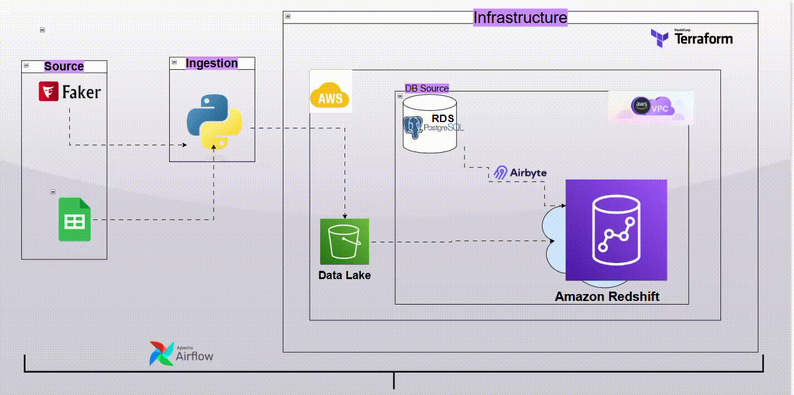

# 4WD HEALTH PROJECT :  `daas Global` Health Records Infrastructure 🚑
🌍 Project Context

`daas Global` is a healthcare facility network committed to providing medical services to underserved regions across Africa. In alignment with SDG-3 (Good Health & Well-being), stakeholders envisioned a centralized health data platform to unify records from facilities operating across multiple countries.

The goal is to enable data-driven decision-making by identifying prevalent illnesses in different regions, helping policymakers and partners such as the World Health Organization (WHO) design effective preventive measures and interventions.

To support this mission, the project implements a cloud-native data infrastructure that consolidates patient health records from multiple sources into a single, scalable warehouse, ensuring accessibility, reliability, and analytical readiness.

<!-- This project is a robust and scalable **ETL pipeline** for consolidating patient health records from multiple data sources into a centralized data warehouse (Amazon Redshift). It demonstrates data engineering best practices including orchestration with **Apache Airflow**, integration via **Airbyte**, infrastructure provisioning with **Terraform**, and the use of **AWS** cloud services. -->

## 📌 Project Overview

The pipeline extracts health data from two primary sources:
1. **Google Sheets** – Live health records from a shared spreadsheet (via Google Sheets API).
2. **SimuHealth** *(synthetic source)* – Programmatically generated fake health data using the `Faker` library to simulate electronic health record systems for testing and development purposes.

Each dataset is processed and routed through different transformation and loading strategies, then unified in Redshift for analytics and reporting.

---

## 🛠️ Tech Stack

| Layer | Tools & Services |
|------|------------------|
| Orchestration | Apache Airflow |
| Infrastructure | Terraform |
| Data Sources | Google Sheets API, SimuHealth (Faker-generated) |
| Cloud | AWS (S3, RDS, Redshift) |
| Integration | Airbyte |
| Programming | Python |

---

<!--  -->

## 🔄 Data Flow Summary

### 🔹 Google Sheets Source
- Extracted via **Google Sheets API**
- Transformed and saved as `.parquet`
- Loaded to **Amazon S3**
- Ingested into **Redshift** via **Airflow**

### 🔹 SimuHealth (Faker) Source
- Generated using `Faker` to simulate structured health records
- Loaded directly into **AWS RDS (PostgreSQL)** using **Airflow**
- Synchronized to **Redshift** using **Airbyte**

---

## 🏗️ Infrastructure

The entire infrastructure is fully managed via **Terraform**, ensuring reproducibility and scalability. Key provisioned components include:
- **Amazon Redshift** (with IAM Role, Pause, Resume, and Resize scheduling)
- **S3 buckets**
- **RDS PostgreSQL**
- **Airflow & Airbyte deployment scaffolds**
- **IAM roles and policies**

## 🏢 Enterprise-Grade Features

- **High Reliability**: Automated retries, error handling, and alert hooks in Airflow DAGs
- **Performance Optimization**: Redshift lifecycle tuning (pause/resume/resize) to balance cost and speed
- **Infrastructure Automation**: Terraform scripts ensure reproducible, scalable deployments
- **Secure Data Handling**: IAM roles with least-privilege policies for service integration
- **Future-Ready**: Architecture prepared for real-time ingestion via Kafka/Kinesis
- **Multi-Source Integration**: Supports both real-world (Google Sheets) and synthetic (SimuHealth) datasets
- **Separation of Concerns**: Staging layers (S3, RDS) before warehousing in Redshift

<!-- ## 👤 Author
#### Taofeecoh Adesanu
##### Data Engineer | Cloud & Data Infrastructure Enthusiast -->
---